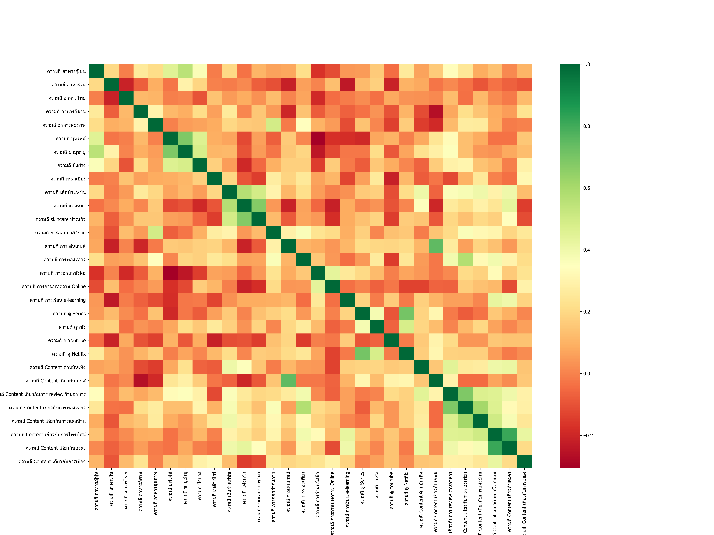

## **Analysis of Customer Behaviors**

BADS7105 : CRM Analytics and Intelligence | Homework 1

Topic : Analysis of Customer Behaviors

Data : complete_data.xlsx

### <ins> MISSING DATA </ins>

- Unknown Gender : Impute Gender with Random Forest 

 

- Unknown Age : Impute Gender with Regression

 

[Colab this part](https://github.com/theptat002/BADS7105-CRM-Analytics-and-Intelligence/blob/main/Homework%2001/BADS7105_Homework_01_PART02_Impute_Missing.ipynb)

### <ins> FREQ HEATMAP </ins>

 

### <ins> INTEREST HEATMAP </ins>

 

