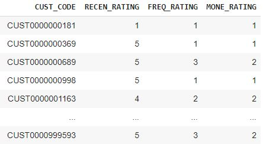

## **Segmentation**

BADS7105 : CRM Analytics and Intelligence | Homework 6

Topic : Segmentation 

Data : Supermarket

### <ins>Explore</ins>

  ข้อมูลที่นำมาใช้จะเป็นข้อมูลที่อยู่ในรูปของ Transaction นะครับจะเป็นราย Basket Id (เดาว่าคือคีย์ของแต่ละ Bill นะ ><)

<p align="center">
 
</p>

ข้อมูลมาจะมี Feature ประกอบด้วย CUST_CODE , SHOP_DATE , BASKET_ID , BASKET_TYPE , C_PRO_CODE , QTY , AMT

```diff
- !!! C_PRO_CODE  : จำนวน Product Code ที่อยู่ในแต่ละบิล 

- !!! BASKET_TYPE : คาดการณ์ว่าเป็นประเภทของ SHOP 
```
ลองทำ Scatter Plot ดูความแตกต่างระหว่าง QTY กับ AMT โดยใช้สีแยกในแต่ละ BASKET TYPE ดูหน่อยว่าแตกต่างมั้ย

<p align="center">
 
</p>

อื้มม ก็พอจะเห็นว่าในแต่ละประเภทของ SHOP นั้นมีความแตกต่างกันอยู่ ฉะนั้น Segmentation ที่เราจะทำก็คงต้องสามารถอธิบายประเภทของร้านค้าพวกนี้ได้ด้วย(ละมั้ง)

<!--  -->

### <ins>Create Feature for represent behavior</ins>

  เริ่มต้นด้วยการคิดอะไรไม่ออกก็ลองมองไปที่ RFM ก่อนเลย แต่ใน RFM นั้นผมว่าจะลองบิดตัวแปรบางตัวเช่น F นั้นเปลี่ยนเป็น ความหลากหลายในการซื้อสินค้าแทน
- R -> Recency | AVG_DATE_DIFF : แทนด้วยจำนวนวันเฉลี่ยที่ลูกค้าจะมาซื้อของที่ร้าน เช่น นาย B จะมาซื้อของทุกๆ 30 วัน เป็นต้น
- V -> Variety | C_PRO_CODE : ตัวแปรนี้จะเป็นความหลากหลายของสินค้าที่ลุกค้าเข้ามาซื้อต่อ Transaction ที่เกิดขึ้น
- M -> Monetary | AVG_TTL_AMT : Ticket size ต่อ transaction ของลูกค้า 

เนื่องจากอยากได้ลักษณะของลุกค้าในแต่ละตัวแปรว่าปกติแล้วลูกค้าจะมีการเกาะกลุ่มกระจุกกันแบบไหนบ้างในแต่ละตัวแปรเลยทำการโยนแต่ละตัวแปรเข้าไปให้ Kmeans ทำการจัดกลุ่มให้กับเราเพื่อใช้ในการอธิบายลักษณะของลูกค้าให้กับเราละกัน

```diff
R -> AVG_DATE_DIFF : ไหนลองให้ Kmeans จัดกลุ่มให้เราซักหน่อยซิโดยใช้ Elbow Curve ในการเลือกตามใน spoil 
```

<details> 
  <summary>Elbow Curve with Fearture -> AVG_DATE_DIFF </summary>
  <p align="center">
    
    
    จิ้มๆเอาตรง 4 ละกัน กำลังหักข้อพอดี 5555
    ปล.ทำการ Scale ด้วย Standatdize เด้อออ
  </p> 
</details>

<details> 
  <summary>จากนั้นก็จัดการ Cluster ด้วย K-means Algorithm ตามจำนวน K ที่เลือก แล้วมาดูผลลัพท์กัน</summary>
  <p align="center">
    
    
    ก็จากผลลัพท์ที่ได้เลยลอง Groupby Data ด้วย Kmeans ที่แบ่งออกมาได้จึงสรุป Label ให้แต่ละกลุ่มออกเป็นดังนี้
    
    - Cluster 0 : ตั้งชื่อให้ว่าเป็นกลุ่มที่มีลักษณะมาซื้อสินค้าระดับ Quarterly ละกัน
    - Cluster 1 : ตั้งชื่อให้ว่าเป็นกลุ่มที่มีลักษณะมาซื้อสินค้าระดับ Yearly ละกัน
    - Cluster 2 : ตั้งชื่อให้ว่าเป็นกลุ่มที่มีลักษณะมาซื้อสินค้าระดับ Outlier ไปเลยนานๆใช้ทีไม่ดีเลยนะลูกค้ากลุ่มนี้
    - Cluster 3 : ตั้งชื่อให้ว่าเป็นกลุ่มที่มีลักษณะมาซื้อสินค้าระดับ Monthly ละกัน กลุ่มนี้น่าจะเป็นกลุ่มลูกค้าที่ดีในแง่ของการมาซื้อของที่ร้าน เนื่องจากมาค่อนข้างบ่อย
    
    ##ลืมบอกไป ลูกค้าที่นำมา Cluster ในกลุ่มตัวแปรนี้จะตัดลูกค้าที่เคยมาซื้อของที่ร้านครั้งเดียวออกนะ กลุ่มนั้นก็จะถูกจำแนกเป็น Come Once ไปแทน เนื่องจากพึ่งมาแค่ครั้งเดียวไม่สามารถหาจำนวนวันที่จะมาอีกได้ 
    อีกอย่างคิดว่าการที่เค้ามาแค่ครั้งเดียวอาจจะยังไม่สามารถอธิบายอะไรได้มากพอ เนื่องจากปกติแล้วร้านค้าก็มักจะมีเหล่าลูกค้าที่ผ่านมาและผ่านไปอยู่เสมอๆนั่นแหละ
  </p> 
</details>

```diff
V -> Variety : ไหนลองให้ Kmeans จัดกลุ่มให้เราซักหน่อยซิโดยใช้ Elbow Curve ในการเลือกตามใน spoil 
```

<details> 
  <summary>Elbow Curve with Fearture -> AVG_C_PRO_CODE </summary>
  <p align="center">
    
    
    Choosen K = 5
    ปล.ทำการ Scale ด้วย Standatdize เด้อออ
  </p> 
</details>

<details> 
  <summary>จากนั้นก็จัดการ Cluster ด้วย K-means Algorithm ตามจำนวน K ที่เลือก แล้วมาดูผลลัพท์กัน</summary>
  <p align="center">
    
    
    ก็จากผลลัพท์ที่ได้เลยลอง Groupby Data ด้วย Kmeans ที่แบ่งออกมาได้โดยจะเห็นว่าจะแบ่งเป็นระดับต่างๆของความหลากหลายในการซื้อ จึงสรุป Label ให้แต่ละกลุ่มออกเป็นดังนี้
    
    - Cluster 2 -> Low : ซื้อครั้งนึงไม่กี่ประเภทสินค้า
    - Cluster 0 -> Medium : ซื้อระดับกลางๆ 
    - Cluster 1,4,3 -> High : ซื้่อที่หลายประเภทมาก
    
  </p> 
</details>

```diff
M -> Monetary : ไหนลองให้ Kmeans จัดกลุ่มให้เราซักหน่อยซิโดยใช้ Elbow Curve ในการเลือกตามใน spoil 
```

<details> 
  <summary>Elbow Curve with Fearture -> AVG_TTL_AMT หรือก็คือ Ticket Size นั่นแหละนะ </summary>
  <p align="center">
    
    
    Choosen K = 5
    ปล.ทำการ Scale ด้วย Standatdize เด้อออ
  </p> 
</details>

<details> 
  <summary>จากนั้นก็จัดการ Cluster ด้วย K-means Algorithm ตามจำนวน K ที่เลือก แล้วมาดูผลลัพท์กัน</summary>
  <p align="center">
    
    
    ก็จากผลลัพท์ที่ได้เลยลอง Groupby Data ด้วย Kmeans ที่แบ่งออกมาได้ เนื่องจากเป็น Ticket_size เลยนำลักษณะของกลุ่มที่ได้แบ่งเป็นระดับของการใช้จ่ายขึ้นมา
    
    - Cluster 0 -> Low 
    - Cluster 2 -> Medium 
    - Cluster 1 -> Moderate 
    - Cluster 3 -> High 
    - Cluster 4 -> Extra 
    
  </p> 
</details>

### <ins>Summary that result</ins>

```diff 
เห็นทีต้องเรียบเรียงผลลัพท์กันซักหน่อย

- R -> AVG_DATE_DIFF : จำนวนวันเฉลี่ยที่ลูกค้าจะมาซื้อของที่ร้าน พบว่าแบ่งออกเป็น Monthly , Quarterly , Yearly , Outlier , Come Once โดยให้ Rating เป็น 5 , 4 , 3 , 2 , 1 ตามลำดับ 
+ V -> C_PRO_CODE    : จำนวนประเภทสินค้าที่ซื้อต่อ transaction พบว่าแบ่งออกเป็น Low , Medium , High โดยให้ Rating เป็น 3 , 2 , 1 ตามลำดับ 
! M -> AVG_TTL_AMT   : Ticket_size ของลูกค้าโดยแบ่งออกเป็นระดับ Extra , High , Moderate , Medium , Low โดยให้ Rating เป็น 5 , 4 , 3 , 2 , 1 ตามลำดับ 

```

### <ins>Combination all Feature</ins>

จากนั้นนำตัวแปรที่สร้างขึ้นมาหลังจาก Convert จาก Label เป็น Rating แล้วจะได้เป็น RECEN_RATING , FREQ_RATING , MONE_RATING ซึ่งจะนำตัวแปรเหล่านี้มาใช้ในการ Cluster กลุ่มลุกค้าอีกทีนึง

<p align="center">
 
</p>

ก่อนจะทำการ Cluster กลุ่มลุกค้าอีกครั้งนึงนั้น เราจะทำการแยกกลุ่มลูกค้าที่เป็นลูกค้าชั้นดีออกมาก่อนโดยให้ชื่อว่าเป็นกลุ่ม "Loyal" ซึ่งเป็นกลุ่มที่มี RECEN_RATING = 5 , FREQ_RATING >= 2 , MONE_RATING >= 3
และจะนำลูกค้าที่เหลือไปทำการ Cluster ออกมาใหม่อีกครั้งนึง

หลังจากแยกลูกค้ากลุ่มชั้นดีออกไปแล้วจากนั้นเราจะทำการนำลูกค้ากลุ่มที่เหลือมาทำการ Cluster เพื่อทำการ Segment ให้กับลูกค้าของเราว่าลูกค้าเราเป็นลูกค้าแบบไหนกันบ้าง ไปดูกันเลย
<details> 
  <summary>Elbow เพื่อเลือกจำนวน K จากตัวแปร RECEN_RATING , FREQ_RATING , MONE_RATING </summary>
  <p align="center">
    
  </p>
</details>

<p align="center">
  
</p>

### จากการทำ K-Means Clustering สรุปผลออกมาจากลักษณะของค่าต่างๆได้ดังนี้ครับ

- Cluster 1,3 -> Low Active | เป็นกลุ่มลูกค้าที่ไม่ค่อยมาซื้อซักเท่าไหร่ มาแล้วหาย หรือ พึ่งมา หรือ มาแล้วนานมากกว่าจะกลับมาอีก  
- Cluster 2 -> Occational | มาใช้บ้างประปรายมาแล้วหายไปค่อนข้างนานหน่อยและก็ไม่ได้ซื้อเยอะแยะอะไร อาจจะไม่ได้มีสินค้าดนใจให้เข้ามาบ่อยๆ แต่ก็เข้ามาซื้อบ้าง
- Cluster 0 -> Potential  | แววดี ถ้าเข้าไป Boost กับกลุ่มลูกค้าเหล่านี้อาจจะกลายเป็นลูกค้าชั้นดีกับเราได้เลย
- Cluster 4 -> General | กลุ่มลูกค้าทั่วไป มาใช้บ่อยแต่ไม่ได้ใช้เยอะแยะอะไร 

ซึ่งจะทำให้เราได้กลุ่มทั้งหมดออกมามีรูปร่างหน้าตาประมาณภาพด้านล่างนี้ครับ ประกอบด้วย Loyal , General , Potential , Occational , Low Active 

<p align="center">
  
</p>

ซึ่งสามารถหยิบจับไปใช้ประโยชน์ต่อไปได้ เช่น

- ต้องการกลุ่มลูกในการทำ Promotion แล้วเราอยากจะ Boost ให้ลูกค้ากลุ่มนั้นกลายไปเป็นกลุ่มลูกค้าชั้นดีได้ไม่ยาก ก็เลือกจิ้มไปที่กลุ่ม Potential เป็นต้น
- ต้องการ Maintain กลุ่มลูกค้าชั้นดีของเราให้ดีต่อเนื่องด้วย Service ต่างๆเพื่อรักษากลุ่มลูกค้าที่เป็น Loyal เอาไว้
- กลุ่มลูกค้า General คือกลุ่มลุกค้าที่มาใช้กับเราบ่อยๆ แต่ไม่ได้มี Ticket Size สูงมากนัก เราก็สามารถหาต่อได้ว่าทำยังไงได้บ้างที่เราจะ Upsale กลุ่มนี้ขึ้นมาได้

<p align="center">
  
</p>

ถือว่าเป็นการแบ่งที่ค่อนข้างโอเคอยู่นะครับ จะเห็นว่าแต่ละกลุ่มเราควรโฟกัสลูกค้าอย่างไรดี เช่น ทำยังไงให้กลุ่ม Occational นั้นหันกลับมาซื้อสินค้ากับเราบ่อยๆ 
หรือจะเป็น ทำยังไงให้กลุ่มลูกค้าที่เป็น General ขยับไปเป็นกลุ่มลูกค้าที่เป็น Potential ได้เป็นต้น

สุดท้ายลองเอา Segment ของกลุ่มลูกค้าที่เราได้ไปเปรียบเทียบกันในแต่ละประเภท Shop หน่อยว่า Shop แบบไหนมีลักษณะลูกค้าอย่างไรกันบ้าง ไปดูกันครับผมม

<p align="center">
  
</p>

เราก็จะเห็นนะครับว่าแต่ละลักษณะของ BASKET_TYPE หรือ ลักษณะร้าน(เดา) จะมีลักษณะของลูกค้าที่แตกต่างกันที่เข้ามาซื้อสินค้า ณ SHOP นั้นๆ

- SHOP ที่เป็น TOP กับ FULL นั้นจะพบลูกค้าประเภท Potential ค่อนข้างเยอะหน่อย คาดว่าอาจจะเป็นเพราะ ร้านค้านั้นมีลักษณะใหญ้และมีสินค้าให้เลือกเยอะ ทำให้บุคคลที่เข้ามาซื้อนั้นค่อนข้างมีกำลังในการซื้อไปด้วย
- SHOP ที่เป็นแบบ XX กับ SML(Small) นั้นจะพบลูกค้า General และ Low active เยอะกว่า อาจจะด้วยเป็นร้านค้าแนวๆร้านสะดวกซื้อซึ่งเหมาะแก่การผ่านเข้ามาซื้อแบบฉาบฉวยแค่ไม่กี่อย่างและตัวสินค้าเองก็อาจจะไม่ได้มีเยอะเมื่อเทียบกับอีก 2 แบบก่อนหน้า


สำหรับการลองทำ Segment ด้วยข้อมูล Supermarket นั้นจบเพียงเท่านี้ครับ อาจจะมีอะไรผิดพลาดหรือมั่วไปบ้าง(T-T) ก็ขออภัยไว้ ณ ที่นี้ด้วยครับ ขอบคุณครับ :)
