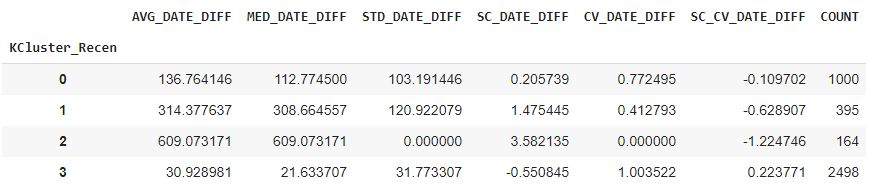

## **Segmentation**

BADS7105 : CRM Analytics and Intelligence | Homework 6

Topic : Segmentation 

Data : Supermarket

### <ins>Explore</ins>

  data from supermarket.csv base on transaction(basket_id)

<p align="center">
 
</p>

Scatter plot check difference between BASKET_TYPE

<p align="center">
 
</p>


<!--  -->

### <ins>Create Feature for represent behavior</ins>

- R -> Time to event | AVG_DATE_DIFF : Time to event .
- V -> Variety | C_PRO_CODE : Number of distinct procode in txn .
- M -> Monetary | AVG_TTL_AMT : Ticket size

### <ins>Kmeans each feature</ins>

```diff
R -> AVG_DATE_DIFF 
```

  <summary>Elbow Curve with Fearture -> AVG_DATE_DIFF </summary>
  <p align="center">
    
  </p> 

  <summary>Select K and run Kmeans cluster</summary>
  <p align="center">
    
    
    Represent Cluster by means of feature each Cluster
    
    - Cluster 0 : Quarterly
    - Cluster 1 : Yearly
    - Cluster 2 : Outlier
    - Cluster 3 : Monthly
    
    ##for customer have only once day at shop -> Come Once
  </p> 

```diff
V -> Variety 
```

  <summary>Elbow Curve with Fearture -> AVG_C_PRO_CODE </summary>
  <p align="center">
    
  </p> 

  <summary>Select K and run Kmeans cluster</summary>
  <p align="center">
    
    
   Represent Cluster by means of feature each Cluster
    
    - Cluster 2 -> Low
    - Cluster 0 -> Medium 
    - Cluster 1,4,3 -> High 
    
  </p> 
</details>

```diff
M -> Monetary 
```

<details> 
  <summary>Elbow Curve with Fearture -> AVG_TTL_AMT </summary>
  <p align="center">
    
  </p> 
</details>

  <summary>Select K and run Kmeans cluster</summary>
  <p align="center">
    
    
    Represent Cluster by means of feature each Cluster
    
    - Cluster 0 -> Low 
    - Cluster 2 -> Medium 
    - Cluster 1 -> Moderate 
    - Cluster 3 -> High 
    - Cluster 4 -> Extra 
    
  </p> 

### <ins>Summary that result</ins>

```diff 
Result 

- R -> AVG_DATE_DIFF : label -> [Monthly , Quarterly , Yearly , Outlier , Come Once]  that can rank by  5 , 4 , 3 , 2 , 1 respectively 
+ V -> C_PRO_CODE    : label -> [Low , Medium , High] that can rank by , 3 , 2 , 1 respectively 
! M -> AVG_TTL_AMT   : label -> [Extra , High , Moderate , Medium , Low] that can rank by  5 , 4 , 3 , 2 , 1 respectively 

```

### <ins>Combination all Feature rating</ins>

combination RECEN_RATING , FREQ_RATING , MONE_RATING 

<p align="center">
 
</p>

split RECEN_RATING = 5 , FREQ_RATING >= 2 , MONE_RATING >= 3 for label -> Loyal 
and  other go to cluster again 

<details> 
  <summary>Elbow for select K from RECEN_RATING , FREQ_RATING , MONE_RATING </summary>
  <p align="center">
    
  </p>
</details>

<p align="center">
  
</p>

### Kmeans-Clustering 

- Cluster 1,3 -> Low Active 
- Cluster 2 -> Occational
- Cluster 0 -> Potential  
- Cluster 4 -> General 

all of segment including by ->  Loyal , General , Potential , Occational , Low Active 

<p align="center">
  
</p>

<p align="center">
  
</p>


<p align="center">
  
</p>

