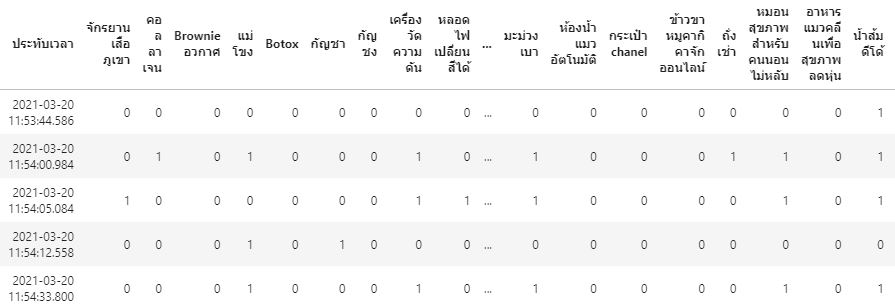
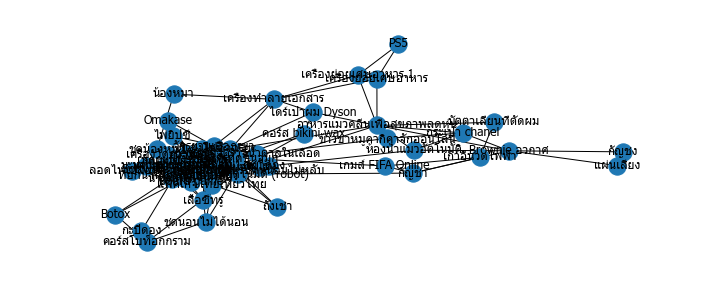

## **Product Recommendation**

BADS7105 : CRM Analytics and Intelligence | Homework 7

Topic : Product Recommendation

Data : Customer Preference Survey.xlsx

## <ins>Explore data</ins>

 

## <ins>Convert data to one-hot encoding</ins>

 

## <ins>Get Result</ins>

 

LIFT ->  lift ratio is the ratio of confidence to expected confidence. Expected confidence is the confidence divided by the frequency of B. The Lift tells us how much better a rule is at predicting the result than just assuming the result in the first place. Greater lift values indicate stronger associations.

 

SUPPORT -> the number of transactions that include items in the {A} and {B} parts of the rule as a percentage of the total number of transactions. It is a measure of how frequently the collection of items occur together as a percentage of all transactions.

 

CONFIDENCE -> the confidence of the rule is the ratio of the number of transactions that include all items in {B} as well as the number of transactions that include all items in {A} to the number of transactions that include all items in {A}.

 

ref : <url>https://infocenter.informationbuilders.com/wf80/index.jsp?topic=%2Fpubdocs%2FRStat16%2Fsource%2Ftopic49.htm</url>

### <ins>Lift x Support</ins>

 

Example -> We should select activiry ->  low support/high condidence/high lift for recommend user. 

### <ins>Network x with Cosine</ins>

 

