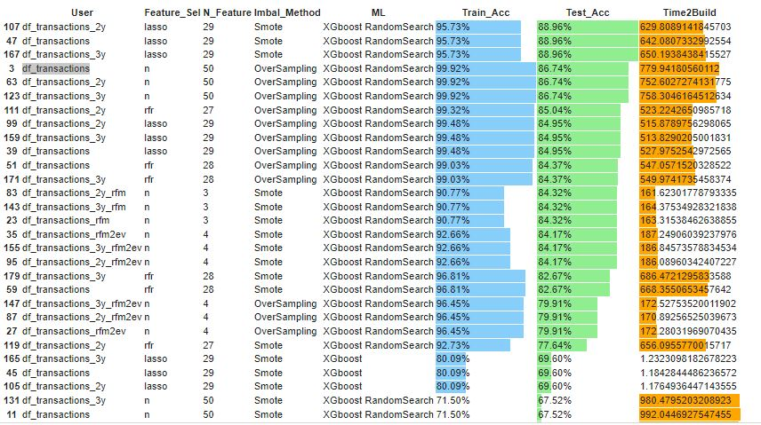

## **Campaign Response Model**

BADS7105 : CRM Analytics and Intelligence | Homework 8

Topic : Campaign Response Model

Data : Retail Data

From AJ.Thanachart Result 

 

Ground truth -> UnderSampling / XGboost / Tune Parameter at Train Accuaracy 74% and Test accuracy 64%

### <ins> Cut Period Data </ins>

- All period
- last 2 year
- last 3 year

 

### <ins> Create Feature </ins>

- RFM only
- RFM + Time 2 Event
- Create new feature also have max 50 features

Preb All data with Class Object PrebData 

 

### <ins> Feature selection </ins>

- Lasso 
<url>https://towardsdatascience.com/feature-selection-using-regularisation-a3678b71e499</url>

- Important from Random Forest
<url>https://towardsdatascience.com/feature-selection-using-random-forest-26d7b747597f</url>

- none

### <ins> Imbalance Handle </ins>

- OverSampling , UnderSampling , Smote

### <ins> Machine Learning </ins>

- Logistic Regression
- Logistic Regression with RandomSearch
- XGboost 
- XGboost with RandomSearch

all combination of data / feature / feature selection / imbalance handle / machine learning -> 180 model from that.

### <ins> Result & Evaluate </ins>

 

The best Model 
- Data Cut period last 2 years.
- Use Lasso Feature Selection and Number of features = 29
- Imbalance Method : "Smote"
- ML : "XGboost"
- Train Acc : 95.73 % , Test Acc : 88.96 % , Time 2 Build : 629.8 sec. or  10 minutes 30 sec
