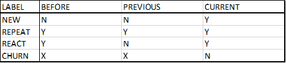
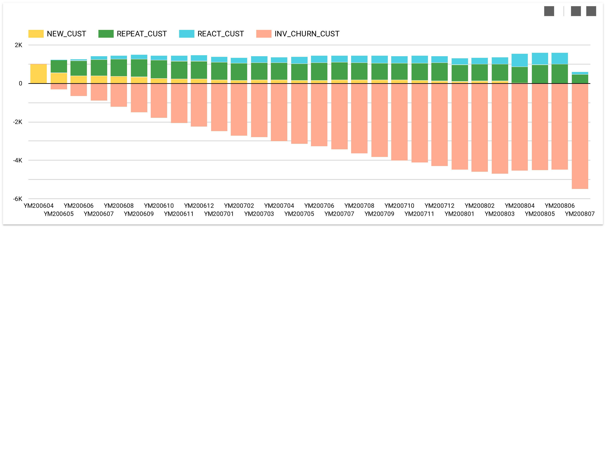

## **Customer Movement**

BADS7105 : CRM Analytics and Intelligence | Homework 10

Topic : Customer Movement 

Data : Supermarket

<p align="center">
 
</p>

Big Query SQL :

```diff

CREATE OR REPLACE TABLE DATA_SUPER_BADS.PREB_DATA_LATEST 
as 
select * ,
(CASE 
     WHEN CURRE_DATE_SPEND = FIRST_DATE_SPEND and PREVI_DATE_SPEND is null then "NEW"
     WHEN DATE_DIFF(CURRE_DATE_SPEND, PREVI_DATE_SPEND, MONTH) = 1 then "REPEAT"
     WHEN DATE_DIFF(CURRE_DATE_SPEND, PREVI_DATE_SPEND, MONTH) > 1 then "REACTIVATE"
     ELSE null
END
     )  as Label_Cust , 
DATE_DIFF(CURRE_DATE_SPEND, PREVI_DATE_SPEND, MONTH) as DATE_DIFF_TEST
from (
    select * ,
    PARSE_DATE("%Y%m%d", CAST(YYMM_DT_BEF as STRING)) FIRST_DATE_SPEND , 
    PARSE_DATE("%Y%m%d", CAST(YYMM_DT_PRE as STRING)) PREVI_DATE_SPEND ,
    PARSE_DATE("%Y%m%d", CAST(PIR_PURCH_DT as STRING)) CURRE_DATE_SPEND ,
    from (
            select * , 
            1 as COUNT_MTH , 
            FIRST_VALUE(PIR_PURCH_DT)
                OVER (PARTITION BY CUSTOMER_NO ORDER BY PIR_PURCH_DT ASC
                ROWS BETWEEN UNBOUNDED PRECEDING AND UNBOUNDED FOLLOWING) AS YYMM_DT_BEF,
            LAG(PIR_PURCH_DT) OVER (PARTITION BY CUSTOMER_NO ORDER BY PIR_PURCH_DT ASC)as YYMM_DT_PRE ,
            from (
                    select CUST_CODE as CUSTOMER_NO , substr(CAST(SHOP_DATE as STRING),1,6) as YYMM_DT , min(SHOP_DATE) as PIR_PURCH_DT
                    from DATA_SUPER_BADS.bads_supermkt 
                    where CUST_CODE is not null 
                    group by CUSTOMER_NO , YYMM_DT 
                    order by CUSTOMER_NO , YYMM_DT
                )
            order by CUSTOMER_NO , YYMM_DT ASC
    )
)
;   

CREATE OR REPLACE TABLE DATA_SUPER_BADS.CUST_KEY
as 
select 
distinct CUSTOMER_NO ,
substr(CAST(YYMM_DT_BEF as STRING),1,6) as FIRST_MTHYR
from DATA_SUPER_BADS.PREB_DATA_LATEST ;


CREATE OR REPLACE TABLE DATA_SUPER_BADS.ALL_YRMTH
as 
select distinct substr(CAST(PIR_PURCH_DT as STRING),1,6) as ALL_MTHYR from DATA_SUPER_BADS.PREB_DATA_LATEST ;

CREATE OR REPLACE TABLE DATA_SUPER_BADS.KEY_TABLE 
as
SELECT a.CUSTOMER_NO as CUSTOMER_NO , a.FIRST_MTHYR as YYMM_DT  , b.ALL_MTHYR as ROLLING_YYMM from  DATA_SUPER_BADS.CUST_KEY  as a
cross join DATA_SUPER_BADS.ALL_YRMTH as b
where b.ALL_MTHYR >= a.FIRST_MTHYR 
order by CUSTOMER_NO , YYMM_DT , ROLLING_YYMM ;


CREATE OR REPLACE TABLE DATA_SUPER_BADS.MAIN_TABLE_OK 
as
SELECT a.CUSTOMER_NO as CUSTOMER_NO , a.ROLLING_YYMM as ROLLING_YYMM , 
b.YYMM_DT as CURRENT_YYMM ,
b.FIRST_DATE_SPEND as FIRST_DATE_SPEND  ,
b.PREVI_DATE_SPEND as PREVI_DATE_SPEND  ,
b.CURRE_DATE_SPEND as CURRE_DATE_SPEND  ,
b.Label_Cust as LABEL_CUST ,
(CASE WHEN LABEL_CUST is null then "CHURN" else LABEL_CUST end ) as LABEL_CUST_OK
from DATA_SUPER_BADS.KEY_TABLE as a 
left join DATA_SUPER_BADS.PREB_DATA_LATEST as b
on a.CUSTOMER_NO = b.CUSTOMER_NO and a.ROLLING_YYMM = b.YYMM_DT 
order by CUSTOMER_NO , ROLLING_YYMM ;

CREATE OR REPLACE TABLE RESULT_TABLE 
AS
SELECT 
CONCAT("YR",CAST(ROLLING_YYMM as STRING)) as ROLLING_YYMM ,
(CASE when NEW_CUST is null then 0 else NEW_CUST end) as NEW_CUST , 
(CASE when REPEAT_CUST is null then 0 else REPEAT_CUST end) as REPEAT_CUST ,
(CASE when REACT_CUST is null then 0 else REACT_CUST end) as REACT_CUST ,
(CASE when CHURN_CUST is null then 0 else CHURN_CUST end) as CHURN_CUST ,
(CASE when CHURN_CUST is null then 0 else CHURN_CUST*-1 end) as INV_CHURN_CUST
from (
  SELECT 
  ROLLING_YYMM ,
  ANY_VALUE(IF(LABEL_CUST_OK="NEW",NO_CUST,null)) as NEW_CUST ,
  ANY_VALUE(IF(LABEL_CUST_OK="REPEAT",NO_CUST,null)) as REPEAT_CUST ,
  ANY_VALUE(IF(LABEL_CUST_OK="REACTIVATE",NO_CUST,null)) as REACT_CUST ,
  ANY_VALUE(IF(LABEL_CUST_OK="CHURN",NO_CUST,null)) as CHURN_CUST 
  from (
          SELECT ROLLING_YYMM , LABEL_CUST_OK ,
          count(distinct CUSTOMER_NO) as NO_CUST
          from DATA_SUPER_BADS.MAIN_TABLE_OK 
          group by ROLLING_YYMM , LABEL_CUST_OK 
          order by ROLLING_YYMM , LABEL_CUST_OK
  )
  group by ROLLING_YYMM 
  order by ROLLING_YYMM 
)
;

```

<p align="center">
 
</p>
