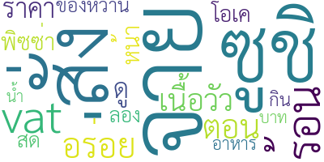
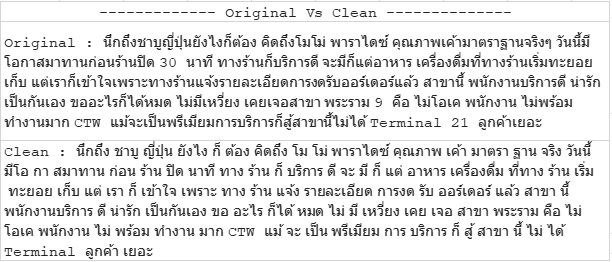

## **Voice Analysis**

 

BADS7105 : CRM Analytics and Intelligence | Homework 9

Topic : Voice Analysis

Data : CustomerReviews.csv

### <ins>Explore</ins>

<ins>Rating of each merchant</ins>

 

<ins>important word in review</ins>

 

### <ins>Flow Process</ins>

 

### <ins>Process</ins>

#### <ins>Label review comment</ins>

 

Label -> each review relate about -> (Service , Food , Price) or (บริการ , อาหาร , ราคา )

#### <ins>Preparation data</ins>

 

Cleansing -> Cut punctuation / Only Thai x Eng / Tokenize(engine = newmm) then concat with space

#### <ins>Model Result</ins>

 

Model Accuracy One vs Rest with SVM Classification

#### <ins>Implement Test</ins>

 

Test with 1 review ><
